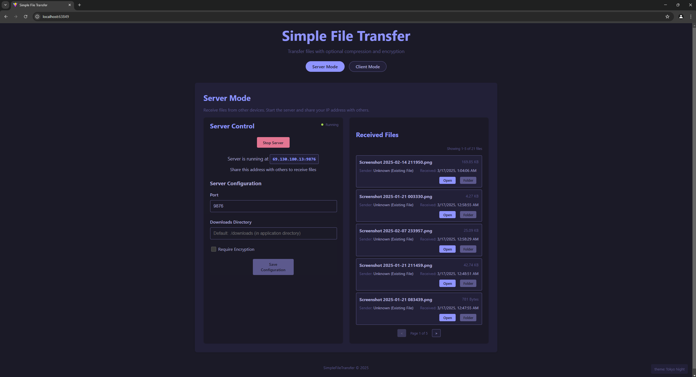
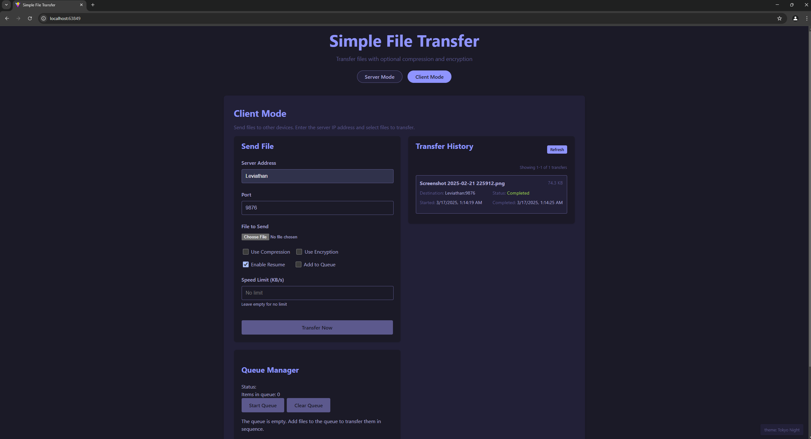

# Simple File Transfer

A simple command-line file transfer utility that allows you to send and receive files over TCP/IP with support for compression, encryption, directory transfers, and more.

## Building the Project

Make sure you have .NET 9.0 SDK installed, then run:

```bash
dotnet build
```

## Running Tests

There are several ways to run the tests:

### Using Visual Studio Test Explorer

Open the solution in Visual Studio and use the Test Explorer to run the tests.

### Using PowerShell Script (Recommended)

Use the provided PowerShell script to run tests with a timeout to prevent hanging:

```powershell
.\scripts\run-tests.ps1
```

### Using dotnet CLI

```bash
dotnet test
```

Note: Running tests directly with `dotnet test` may occasionally hang due to background processes. Use the PowerShell script if this happens.

## Docker Support

The project includes Docker support for both the application and tests. Docker configuration files are located in the `docker` directory.

### Building and Running with Docker

```bash
# Build the Docker image
docker-compose -f docker/docker-compose.yml build

# Run the application in Docker
docker-compose -f docker/docker-compose.yml up simplefiletransfer
```

### Running Tests in Docker

```bash
# Build and run the tests in Docker
docker-compose -f docker/docker-compose.yml build simplefiletransfer.tests
docker run --rm simplefiletransfertests:latest
```

Alternatively, use the provided PowerShell script:

```powershell
.\scripts\run-tests-in-docker.ps1
```

## Usage

### Receiving Files (Server Mode)

To start receiving files, run:

```bash
dotnet run receive
```

This will start a server on port 9876 that listens for incoming file transfers.

If you need to receive encrypted files, provide the password:

```bash
dotnet run receive --password mysecretpassword
```

### Sending Files (Client Mode)

#### Single File Transfer

To send a file to another computer, run:

```bash
dotnet run send <host> <filepath>
```

Where:
- `<host>` is the IP address or hostname of the receiving computer
- `<filepath>` is the path to the file you want to send

Example:
```bash
dotnet run send 192.168.1.100 myfile.txt
```

#### Multiple File Transfer

To send multiple files at once:

```bash
dotnet run send <host> <file1> <file2> <file3>...
```

Example:
```bash
dotnet run send 192.168.1.100 file1.txt file2.txt file3.txt
```

#### Directory Transfer

To send an entire directory and its contents:

```bash
dotnet run send <host> <directory_path>
```

Example:
```bash
dotnet run send 192.168.1.100 mydirectory
```

### Transfer Options

The following options can be added to any send command:

#### Compression

Use GZip compression:
```bash
dotnet run send 192.168.1.100 myfile.txt --compress
# or
dotnet run send 192.168.1.100 myfile.txt --gzip
```

Use Brotli compression (better compression ratio):
```bash
dotnet run send 192.168.1.100 myfile.txt --brotli
```

#### Encryption

Encrypt the data during transfer:
```bash
dotnet run send 192.168.1.100 myfile.txt --encrypt mysecretpassword
```

#### Resume Capability

Enable resume capability for interrupted transfers:
```bash
dotnet run send 192.168.1.100 myfile.txt --resume
```

To list all incomplete transfers that can be resumed:
```bash
dotnet run list-resume
```

To resume a specific transfer:
```bash
dotnet run resume <index>
```

Example:
```bash
dotnet run resume 1
```

If the transfer is encrypted, provide the password:
```bash
dotnet run resume 1 --password mysecretpassword
```

### Transfer Queue

You can queue multiple transfers to be executed sequentially:

```bash
dotnet run send 192.168.1.100 myfile.txt --queue
```

Queue management commands:

```bash
dotnet run queue-list      # List all transfers in the queue
dotnet run queue-start     # Start processing the queue
dotnet run queue-stop      # Stop processing the queue
dotnet run queue-clear     # Clear all transfers from the queue
```

## Features

- Simple command-line interface
- Progress bar showing transfer status
- Automatic directory creation for received files
- Error handling for common issues
- Uses TCP/IP for reliable transfer
- Supports files of any size
- Shows transfer speed and progress percentage
- Compression support (GZip and Brotli)
- Encryption support for secure transfers
- Directory transfers with automatic path preservation
- Multiple file transfers in a single operation
- Resume capability for interrupted transfers
- Transfer queue for sequential processing
- Hash verification to ensure data integrity
- Docker support for both application and tests

## Notes

- The server runs on port 9876 by default
- Press Ctrl+C to stop the server
- Make sure the port is open in your firewall if needed
- Received files are saved to a "downloads" directory by default
- You can combine multiple options (e.g., `--brotli --encrypt password --resume`)

## Web Interface

SimpleFileTransfer includes a web interface for easy file transfers. To use the web interface:

1. Start the SimpleFileTransfer API server:
   ```
   dotnet run --project src/SimpleFileTransfer/SimpleFileTransfer.csproj -- --web
   ```

2. Start the web application:
   ```
   cd src/simplefiletransfer.web
   npm run dev
   ```

3. Open your browser and navigate to the URL shown in the console (typically http://localhost:5173)

4. Use the web interface to transfer files with optional compression and encryption 

### Web Interface Features

The web interface provides a modern, user-friendly way to interact with SimpleFileTransfer:

- **Transfer History**: View all current and past file transfers with detailed status information
- **Server Management**: Start and stop the file transfer server directly from the web interface
- **File Queue Management**: Add files to the transfer queue, start/stop queue processing, and clear the queue
- **Received Files List**: Browse and download files that have been received by the server
- **Transfer Options**: Configure compression, encryption, and speed limits through an intuitive interface
- **WebSocket Communication**: Real-time updates using WebSocket technology for instant feedback
- **Responsive Design**: Works on desktop and mobile devices with a responsive layout

### Screenshots

<div align="center">
  <p><strong>Server Mode</strong></p>
  
  <br><br>
  <p><strong>Client Mode</strong></p>
  
</div> 